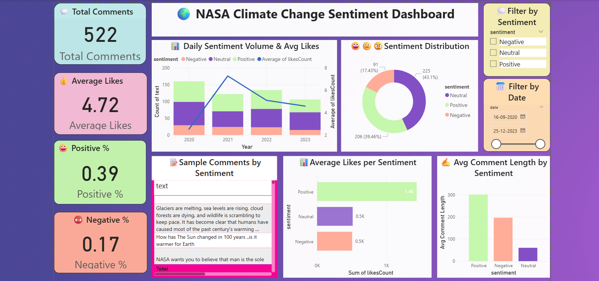
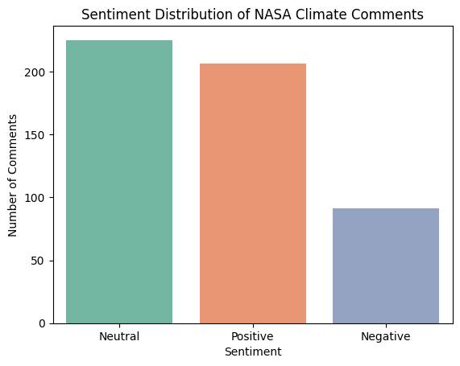
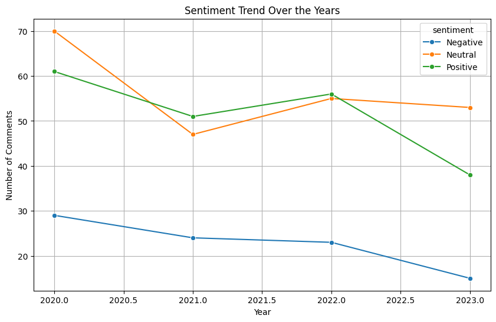
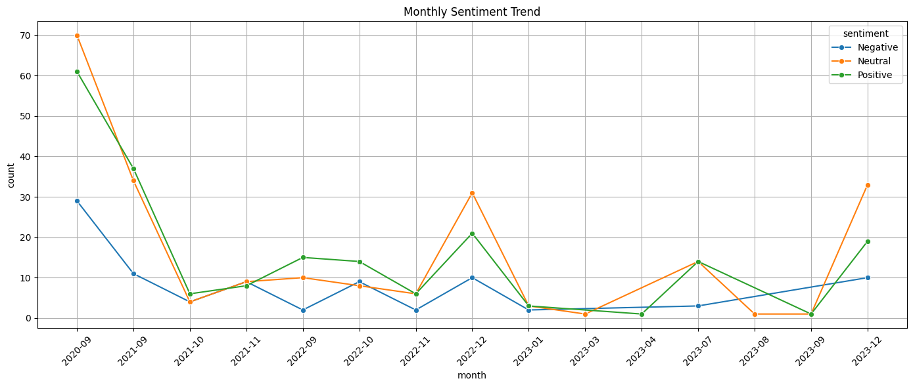
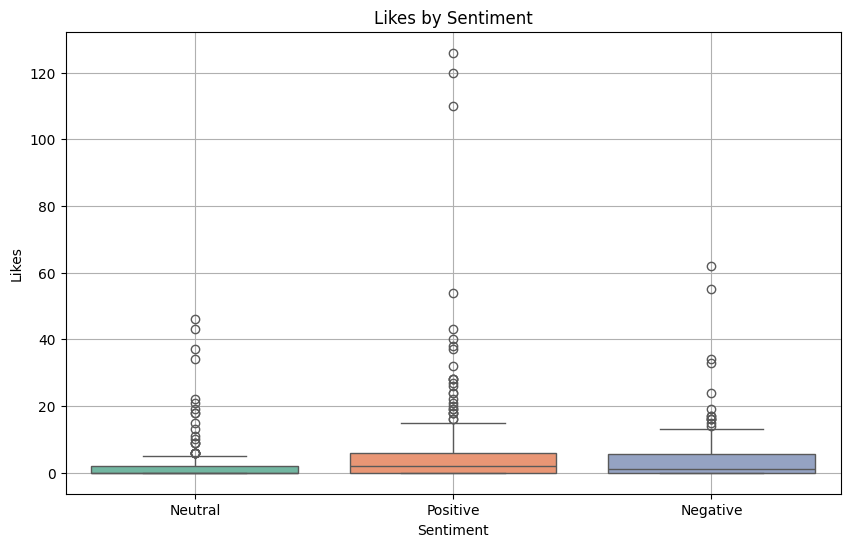
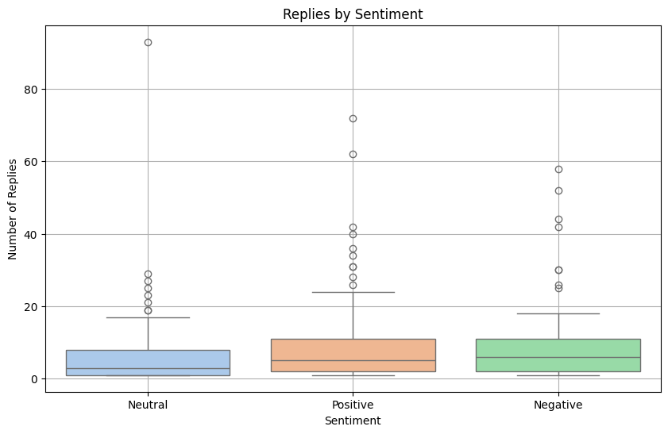
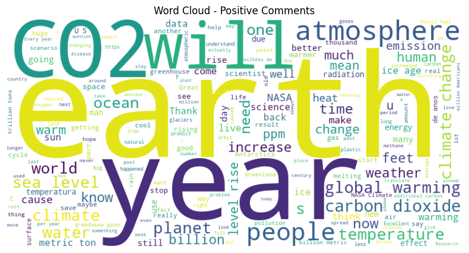
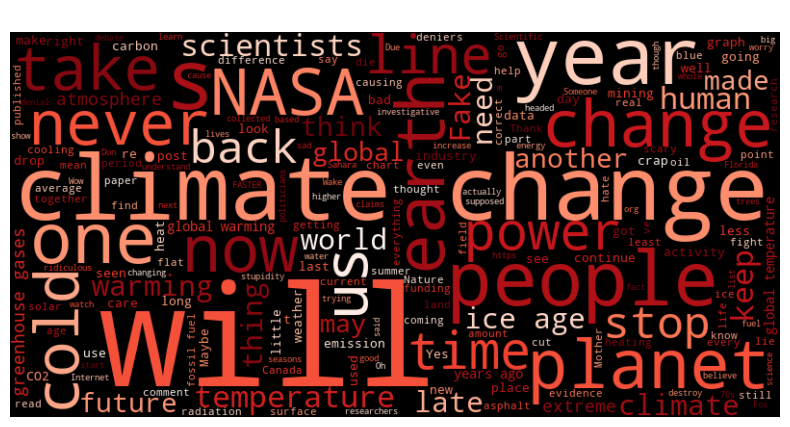
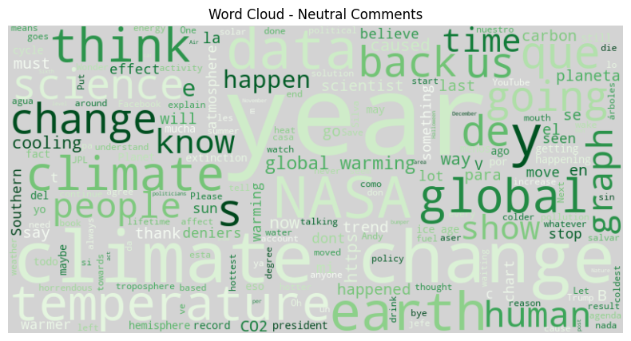
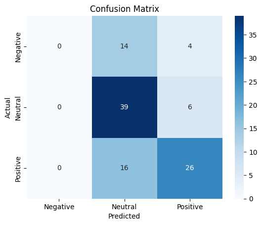

# 🌍 Climate Change Sentiment Analysis — Internship Project

This project was completed as part of my 3-month internship at **Unified Mentor Pvt Ltd**. It focuses on analyzing public sentiment toward climate change using real Facebook comments posted on NASA’s official page. The project includes sentiment classification using NLP and visual storytelling using Power BI and Flask.

---

## 📁 Project Structure

climate_change_modeling/
├── app.py
├── climate_sentiment_dashboard.pbix
├── climate_sentiment_data.csv
├── sentiment_model.pkl
├── vectorizer.pkl
├── eda_and_sentiment_analysis.ipynb
├── README.md
├── templates/
│ └── index.html
├── static/
│ └── background.jpg
└── images/
├── dashboard_main.png
├── ccm1.png to ccm9.png

yaml
Copy
Edit

---

## 🔍 Problem Statement

Analyze NASA’s Facebook climate-related comments to:
- Understand public sentiment
- Build a classification model to categorize text as Positive, Neutral, or Negative
- Visualize sentiment patterns and trends for stakeholders using Power BI

---

## 🧪 Key Tasks Performed

- 🔄 **Data Cleaning** using Pandas
- 💬 **Sentiment Labeling** using TextBlob
- 📊 **Exploratory Data Analysis** (EDA)
- 🧠 **Model Building**: TF-IDF + Logistic Regression
- 🧪 **Evaluation**: Confusion matrix, accuracy
- 🌐 **Flask Web App** to interactively classify user input
- 📈 **Power BI Dashboard** to visualize insights

---

## 💡 Tools & Technologies

- **Python** (pandas, sklearn, textblob)
- **Flask** for model deployment
- **Power BI** for business visualization
- **Jupyter Notebook** for EDA
- **GitHub** for version control

---

## 📊 Power BI Dashboard

A dedicated dashboard was created using Power BI that showcases:

- Sentiment Distribution
- Avg Likes by Sentiment
- Avg Comment Length
- KPI Cards
- Interactive Filters
- Stacked Line & Bar Trends



---

## 📁 Screenshots from EDA and Modeling

| Confusion Matrix | Word Clouds | Sentiment Trends |
|------------------|-------------|------------------|
|  |  |  |
|  |  |  |
|  |  |  |


## 🚀 Flask Sentiment Classifier

You can test your own climate-related comment in the Flask app. It will predict whether it's:

- ✅ Positive
- ⚪ Neutral
- ❌ Negative

To run:

```bash
python app.py
Then open your browser: http://127.0.0.1:5000

## 🧠 Model Overview

This project uses Natural Language Processing (NLP) techniques to analyze public sentiment around climate change based on Facebook comments posted on NASA’s page.

- **Vectorization**: TF-IDF
- **Model Used**: Logistic Regression
- **Accuracy**: **88.57%**
- **Evaluation**: Classification Report and Confusion Matrix used to validate performance.
📎 Internship Note
This project was part of my internship under the mentorship of Unified Mentor Pvt Ltd. It helped me enhance my skills in data analysis, NLP, visualization, and deployment of a real-world data science solution.

📂 Download Power BI File
Download the climate_sentiment_dashboard .pbix file
Filename: climate_sentiment_dashboard.pbix

📬 Contact
Silla Shaju
Data Science Intern
📫 saranammanariyil@gmail.com
📍 Kerala, India
🌐https://www.linkedin.com/in/silla-shaju-309b66322?utm_source=share&utm_campaign=share_via&utm_content=profile&utm_medium=android_app
